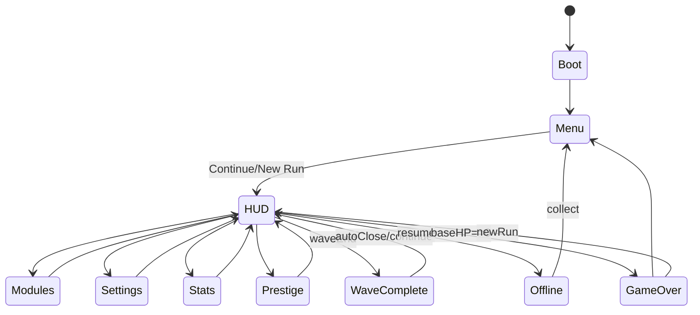

# NEON GRID — Deterministic Idle Tower Defense (Web / Phaser 3)

Tarih: 5 Şubat 2026

Bu doküman “NEON GRID” için **RNG=0**, **sabit wave süresi**, **Kill Ratio cezası** ve **tam deterministik** bir idle tower defense tasarımını ve teknik mimarisini tanımlar.

## 0) Mutlak İlkeler (Non‑Negotiable)

- RNG yok: rastgelelik / drop-rate / şans / lootbox yok.
- Her wave **tam** $T$ saniye sürer (varsayılan $T=30.0$). Timer 0 → wave biter.
- Wave bitince `killRatio = killed / spawned` ölçülür.
  - `killRatio >= threshold(w)` → ceza yok.
  - Değilse → **ödül çarpanı** düşer + opsiyonel **kaçış hasarı** artar.
- Determinizm: Aynı girdiler (wave index, upgrade seviyeleri, modüller, prestige, timestamp farkı) → aynı spawn dizisi, aynı ödül, aynı sonuç.
- Çeşitlilik RNG ile değil deterministik dizilerle: `enemy_type(w,i)`, `wave_pattern(w)`, `dayIndex`.

---

## 1) UI/UX Spesifikasyonu — Tüm Ekranlar

Tema: Neon cyberpunk (near-black + grid + neon glow). Palet config’te sabittir.

### A) Boot / Preload

**Amaç**: deterministik felsefeyi daha ilk karede göstermek.

- Layout
  - Ortada tek panel: başlık + “No RNG / Deterministic” badge
  - Altında progress bar (sadece görsel; gameplay’i etkilemez)
  - “İpucu” satırı: `tipIndex = dayIndex mod tipsCount`
- States
  - `loading` → progress artar
  - `done` → Main Menu
- Events
  - Otomatik geçiş (örn. 0.8–1.2s)

### B) Main Menu

- Layout
  - Orta panel
  - Butonlar: `Continue`, `New Run`, `Settings`, `Credits`
  - “No RNG Mode” açıklama kartı
  - Alt: version/patch
- States
  - `idle`
- Events
  - Continue → HUD (sim unpause)
  - New Run → deterministik yeni state
  - Settings → Settings ekranı

### C) Game HUD (Ana Ekran)

**Desktop layout** (grid):

- Top HUD (panel)
  - Dalga, Süre (mm:ss), Altın, Puan, `DPS_snap`, Base HP
  - Kill Ratio bar:
    - `killRatio_live = killed / spawnedSoFar`
    - `threshold(w)` çizgisi (metinsel gösterim + bar)
    - `penaltyFactor` canlı tahmin
  - Tooltips
    - DPS_snap: “wave başı snapshot; TotalEHP bununla belirlenir”

- Left Panel (collapsible)
  - Tower Upgrades (4 track)
    - Hasar / Atış Hızı / Menzil / Base HP
    - `+1`, `+10`, `+Max`
    - Maliyet satırı: bir sonraki level cost

- Right Panel (collapsible)
  - Live Wave Report: killed / escaped / spawn / beklenen penalty
  - Build Stats: armorPierce, anlık DPS (snap değil)
  - Prestige shortcut
  - Codex shortcut

- Bottom Bar
  - Speed: 1x / 2x / 4x (deterministik timeScale)
  - Auto ON/OFF
  - Pause
  - Settings

**Mobile layout**

- Üst kompakt bar: wave/time/gold + Kill Ratio
- Alt tab bar: `PLAY` `UPGRADES` `MODULES` `STATS`

**Event handlers**

- Speed butonları → `timeScale` set
- Auto toggle → tower auto
- Pause → sim durur
- Upgrade butonları → gold kontrolü → level artışı
- Module slot tap
  - Slot seç → unlocked modül listesi → equip

### D) Modules Screen

- Layout
  - Kategori filtre: OFFENSE / DEFENSE / UTILITY
  - Modül kartı:
    - Ad, ikon konsepti, effect text
    - Unlock (points)
    - Upgrade (gold) +1/+10/+Max
- States
  - `filter = ALL|OFFENSE|DEFENSE|UTILITY`
- Events
  - Unlock: points düş, `modulesUnlocked[id]=true`
  - Upgrade: gold düş, `moduleLevels[id]++`

### E) Wave Complete Overlay

- Gösterim: wave biter bitmez 1–2s overlay
- İçerik
  - killed, escaped
  - killRatio, threshold
  - rewardGold, rewardPoints
  - penaltyFactor (kırmızı uyarı)
- Events
  - Continue (manual)
  - Auto açıkken otomatik kapanır

### F) Prestige / Evolution

- Başlık: “RESET PROTOCOL”
- Göster
  - Bu run: max wave, süre, toplam gold
  - Gain: prestigePoints (deterministik)
  - Yeni multiplier önizlemesi
- Confirm
  - “Hold to confirm” + ikinci confirm

### G) Offline Progress Modal

- Tetik: tab geri gelince veya oyuna dönüşte
- İçerik
  - elapsed time
  - estimated waves progressed
  - gold gained (offlineFactor)
  - “estimated” etiketi
- Events
  - Collect → stateAfter uygulanır

### H) Settings

- Audio sliders (master)
- Quality: Low / Med / High
  - Low: Nmax cap + azaltılmış efekt
- Number format: suffix / scientific
- Reduce effects (motion/glow)
- Export / Import Save (text)

### I) Codex / Stats

- Toplam öldürme/kaçış, best wave, run count
- Modül listesi ve unlock durumları
- Enemy types listesi + deterministik formül açıklaması

---

## 2) UI State Machine (Scene/View Geçişleri)

Aşağıdaki state machine DOM UI view’leri için referanstır:

Phaser tarafında scene akışı ayrı tutulur (BootScene → GameScene). UI bir “view state machine” olarak DOM’da çalışır.

---

## 3) Matematik Model (RNG=0 + Sabit T + Kill Ratio Cezası)

Tanımlar:

- $w$: wave index (1..∞)
- $T$: waveDurationSec (varsayılan 30.0)
- `DPS_snap`: wave başında hesaplanan snapshot
- `TotalEHP(w)`: wave’in hedef EHP bütçesi
- `N(w)`: spawn sayısı
- `killed`, `escaped`
- `killRatio = killed / N(w)`

### 3.1) DPS_snap

- `baseDmg(Ld) = D0 * (1+d)^(Ld-1)`
- `fireRate(Lr) = min(Rmax, R0 + k*log(1+Lr))`
- Modül etkileri:
  - `dmgMult = Π (1 + mi*level_i)`
  - `dmgFlat = Σ (fi*level_i)`
- Prestij:
  - `prestMult(P) = 1 + μ*sqrt(P)`

$$
DPS_{snap} = (baseDmg(L_d)\cdot dmgMult + dmgFlat)\cdot fireRate(L_r)\cdot prestMult(P)
$$

### 3.2) Zorluk çarpanı $G(w)$

Parçalı büyüme:

- Early ($w\le 50$): $G(w)=(1+a)^{w-1}$
- Mid ($50<w\le 200$): $G(w)=(1+a)^{49}(1+b)^{w-50}$
- Late ($w>200$): $G(w)=(1+a)^{49}(1+b)^{150}(1+c)^{w-200}$

### 3.3) TotalEHP(w)

$$
TotalEHP(w) = DPS_{snap}\cdot T\cdot \rho\cdot G(w)
$$

- $\rho$ (clearFactor): 0.85–0.95 (varsayılan 0.90)

### 3.4) Spawn count

$$
N(w) = clamp\Big(N_{min}+\lfloor u\sqrt{w}+v\log(1+w)\rfloor,\;N_{min},\;N_{max}\Big)
$$

`Nmax` kalite moduna göre deterministik seçilir.

### 3.5) Spawn times

$$
 t_i = T\cdot (i/N)^p
$$

`wave_pattern(w)` belirli değerlerde “burst” için zamanı deterministik sıkılaştırır.

### 3.6) Enemy type ve stats

- Enemy type:
$$
 type(w,i) = (A\cdot w + B\cdot i + C)\bmod K
$$

- Mini varyasyon:
$$
 S(i)=1+\beta\Big(\frac{i\bmod m}{m-1}-0.5\Big)
$$

- HP:
$$
 HP(w,i)=\frac{TotalEHP(w)}{N(w)}\cdot S(i)\cdot typeHpMult
$$

- Armor:
$$
 armor(w,i)=min(armorMax, armorAlpha\cdot log(1+w))\cdot typeArmorMult
$$

- Speed:
$$
 speed(w,i)=baseSpeed[type]\cdot (1+speedK\cdot \sqrt{w}/100)
$$

### 3.7) Kill Ratio cezası

- Threshold:
$$
 threshold(w)=clamp(th0+thSlope\cdot log(1+w),\;thMin,\;thMax)
$$

- Penalty:

Eğer `killRatio >= threshold` → `penaltyFactor=1`.

Aksi halde:

$$
 deficit = \frac{threshold-killRatio}{threshold}
$$

$$
 penaltyFactor = clamp(1-penK\cdot deficit,\;penMin,\;1)
$$

- Gold:
`gold_reward = baseGold(w) * penaltyFactor * goldMultModules`

- Escape damage (opsiyonel):
`escaped * escapeDamage * (1 + deficitBoost*deficit)`

### 3.8) Rewards

- `baseGold(w) = g0 * TotalEHP(w)^gamma * (1 + goldWaveK*log(1+w))`
- `points_reward(w) = ceil(p0 * growthPer10^(floor((w-1)/10)))`

### 3.9) Offline progress

- `offlineWaves = floor(elapsedSec / T)`
- `offlineGain = Σ gold_reward(w+k) * offlineFactor`
- Offline killRatio (estimated):

$$
 killRatio_{offline}(w)=clamp(k0+k1\cdot log(1+DPS/TotalEHP(w)),0,1)
$$

UI: “estimated” etiketi zorunludur.

---

## 4) JSON Config Taslağı

- Kaynak: [src/neonGrid/config/neonGrid.config.json](../src/neonGrid/config/neonGrid.config.json)
- Uygulama: [src/neonGrid/config/defaultConfig.ts](../src/neonGrid/config/defaultConfig.ts)

---

## 5) İlk 10 Dakika Onboarding / Tutorial

1) Boot: “Raslantı yok” rozeti (3sn) → Continue highlight
2) HUD: Wave timer + “Süre sabit” tooltip
3) Kill Ratio bar: threshold çizgisi highlight + “Hedef tutmazsa ödül düşer”
4) Upgrade panel: Hasar +1 önerisi (gold yeterliyse)
5) Speed: 2x/4x butonu açıklaması (sim tick sabit)
6) Modüller: Modules butonu highlight → 1 modül unlock
7) Slot equip: Slot 1 highlight → modül tak
8) Wave complete overlay: penaltyFactor örneği göster
9) Settings: Quality Low/Med/High (mobil performans) kısa açıklama
10) Prestige: “reset protocol” kilitli/aktif koşul metni

Tüm adımlar deterministik highlight sırasıyla ilerler; rastgele ipucu yok (dayIndex kullanılır).

---

## 6) Phaser 3 Teknik Mimari

### Önerilen Scene listesi

- `BootScene`
  - Minimal preload
  - `GameScene` başlat

- `GameScene`
  - Fixed tick sim: 60Hz
  - Render: Phaser Graphics
  - SimEngine entegrasyonu

### Sim / Render ayrımı

- Sim: `SimEngine.tick(dt)` — fixed dt, deterministik.
- Render: Phaser `update` sadece bir “driving loop” olarak accumulator kullanır.

### Deterministik fonksiyonlar (tek yerde)

- [src/neonGrid/sim/deterministic.ts](../src/neonGrid/sim/deterministic.ts)
- [src/neonGrid/sim/offline.ts](../src/neonGrid/sim/offline.ts)

### Save

- LocalStorage snapshot
- `lastSaveTimestampUTC` ile offline hesap

---

## 7) Acceptance Checklist

- RNG yok (oyun mantığında rastgelelik çağrısı yok).
- Her wave tam T saniye.
- Kill Ratio cezası: threshold tutmazsa `penaltyFactor < 1` + escape damage.
- Offline deterministik: aynı timestamp farkı → aynı kazanç.
- Mobil performans: quality → Nmax cap.
- UI eksiksiz: Menu/HUD/Modules/Prestige/Settings/Offline/Stats/Wave overlay.
